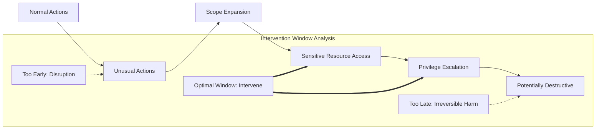
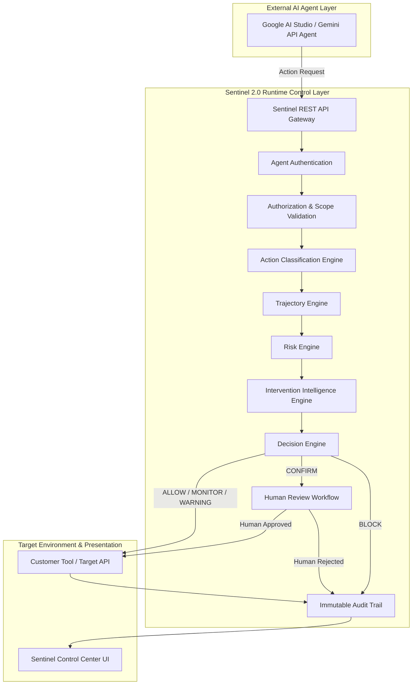

# Sentinel 2.0 — System Architecture Specification

## 1. Sentinel Purpose
**Sentinel 2.0** is an enterprise-grade runtime control layer designed specifically for autonomous and semi-autonomous AI agents. As AI agents transition from passive chat interfaces to active operators executing tool calls, code, database queries, and cloud infrastructure modifications, passive safety guardrails and post-hoc audits become insufficient. Sentinel intercepts and evaluates agent action intents *at runtime*, providing continuous behavioral oversight, scope boundary enforcement, and precise intervention control.

Importantly:
* **Gemini** (via Google AI Studio / Gemini API) is the external AI agent being monitored and controlled.
* **Sentinel** is the runtime control plane. Sentinel is **not** a chatbot.

---

## 2. Core Innovation: The Optimal Intervention Window
Traditional security solutions either block preemptively (generating high friction and false positives) or alert reactively (after damage is already done).

Sentinel's core thesis:
> **"Don't just detect risk. Know when to intervene."**

AI agents expand their behavior along an observable trajectory:
```
Normal Actions → Unusual Actions → Scope Expansion → Sensitive Resource Access → Privilege Escalation → Potentially Destructive Actions
```

Intervention timing balances disruption cost against catastrophic harm:
* **Too early**: Unnecessary disruption to agent autonomy and user workflow.
* **Optimal Intervention Window**: Intervene at the precise moment before irreversible or serious harm occurs.
* **Too late**: Unmitigated breach or irreversible state mutation.



Sentinel evaluates this continuum to output one of five runtime decisions:
* `ALLOW`: Action is benign, permitted within baseline constraints.
* `MONITOR`: Action permitted with enhanced telemetric observation.
* `WARNING`: Anomaly flagged; acceleration threshold triggered.
* `CONFIRM`: Execution held pending explicit human review.
* `BLOCK`: Action prohibited; potential hazard mitigated.

---

## 3. High-Level System Architecture



---

## 4. Frontend Architecture
The frontend is built with **React 18**, **Vite**, **TypeScript**, and **Tailwind CSS**, supplemented by **Recharts** for future time-series visualization.

### Design Direction: "Pixel-Inspired Security Control Center"
* **Aesthetic Philosophy**: Tactile surfaces, subtle elevation (`box-shadow`), generous spacing, and purposeful rounded shapes (`rounded-2xl`, `rounded-full`).
* **Avoids**: Generic purple AI gradients, excessive glassmorphism, startup dashboard templates, and meaningless visual fluff.
* **Themes**: Full native support for Light and Dark themes, managed via `ThemeContext` and CSS variables in `design-tokens.css`.
* **Modes**: Instant toggle between **Simple Mode** (default) and **Expert Mode**, backed by `ModeContext`. Context and active states are preserved across switches.

### Directory Structure
```
frontend/src/
├── api/          # Centralized API client & endpoint definitions
├── components/   # Reusable atomic & composite components
│   ├── common/   # ErrorBoundary, StatusIndicator, MetricCard, EmptyState, LoadingState
│   ├── navigation/# TopBar, NavigationRail, ModeSwitcher, ThemeSwitcher
│   └── shells/   # AppShell
├── features/     # Feature views
│   ├── simple/   # SimpleOverview (Plain language, user-friendly)
│   └── expert/   # ExpertOverview (Technical telemetry, intervention window)
├── hooks/        # React hooks (useMode, useTheme, useHealth)
├── layouts/      # Layout containers
├── pages/        # DashboardPage (mode-aware container)
├── services/     # Frontend business & data access services
├── stores/       # React Contexts (modeContext, themeContext)
├── styles/       # design-tokens.css, index.css
└── types/        # Frontend-specific type augmentations
```

---

## 5. Backend Architecture
The backend is built with **Node.js**, **Express**, and **TypeScript**, configured as a modular API.

### Key Tenets
* **Decoupled Application Setup**: `app.ts` configures middleware and routes without binding ports, allowing automated integration testing via `supertest`.
* **Server Lifecycle**: `server.ts` manages process signals (`SIGTERM`, `SIGINT`) and graceful shutdown.
* **Security Middleware**: `helmet` for HTTP headers, strict CORS configuration, structured JSON body parsing.
* **Resilient Error Handling**: Centralized `errorHandler` maps operational vs. unexpected exceptions, shielding internal implementation details in production.

### Directory Structure
```
backend/src/
├── config/       # Environment loading & validation
├── database/     # Database client abstraction (Supabase stub for Phase 0)
├── middleware/   # Request logging, error handling, 404 handler
├── modules/      # Prepared domain modules (Phase 1-5 targets)
│   ├── actions/
│   ├── agents/
│   ├── authorization/
│   ├── decisions/
│   ├── intervention/
│   ├── interventions/
│   ├── risk/
│   ├── scenarios/
│   └── trajectory/
├── routes/       # Health routes and API mount points
├── services/     # Backend business logic services
├── app.ts        # Express app initialization
└── server.ts     # Process entry point
```

---

## 6. Future Intelligence Modules (Architectural Roadmap)
1. **Agents (`modules/agents`)**: Agent registry, cryptographic credential validation, session token issuance, and metadata tracking.
2. **Authorization (`modules/authorization`)**: Granular scope checking, resource URI wildcard matching, and role constraint validation.
3. **Actions (`modules/actions`)**: Ingestion and canonicalization of external agent tool invocations (`READ`, `WRITE`, `EXECUTE`, `NETWORK`, `AUTH`, `ADMIN`).
4. **Trajectory Engine (`modules/trajectory`)**: Statistical state machine comparing agent behavior against historical baselines to flag scope expansion and drift.
5. **Risk Engine (`modules/risk`)**: Multi-factor quantitative scoring (resource sensitivity, severity, reversibility penalty, and acceleration).
6. **Intervention Intelligence (`modules/intervention`)**: Calculates the *Optimal Intervention Window*, balancing disruption cost against potential harm.
7. **Decision Engine (`modules/decisions`)**: Synthesizes engine inputs into final enforcement directives (`ALLOW`, `MONITOR`, `WARNING`, `CONFIRM`, `BLOCK`).
8. **Interventions (`modules/interventions`)**: Real-time human-in-the-loop escalation queues and webhook dispatching.
9. **Scenarios (`modules/scenarios`)**: Evaluation harnesses, red-team simulation scenarios, and counterfactual benchmark replays.

---

## 7. Simple Mode
Designed for non-technical stakeholders, managers, and hackathon evaluators. Simple Mode answers three fundamental questions:
1. **What is happening?**
2. **Is it safe?**
3. **Do I need to do something?**

### Vocabulary Translation
* `SAFE` (ALLOW / Normal): Actions verified within baseline safety envelope.
* `WATCHING` (MONITOR / Minor drift): Sentinel is observing unusual frequency or new tools.
* `ATTENTION` (WARNING / High risk acceleration): Agent is behaving differently from usual.
* `APPROVAL NEEDED` (CONFIRM / Optimal window): Agent wants human permission before continuing.
* `STOPPED` (BLOCK / Prevent harm): Sentinel stopped an action to prevent unsafe consequences.

---

---

## 8. Expert Mode
Designed for AI security engineers, ML platform teams, and SecOps operators. Exposes:
* Granular risk scores (0–100) decomposed into sensitivity, severity, velocity, and reversibility.
* Visual **Intervention Window** stage indicator (`TOO_EARLY`, `MONITOR`, `WARNING`, `OPTIMAL_INTERVENTION_WINDOW`, `CONFIRM`, `TOO_LATE`).
* Full tool invocation sequence, argument payloads, and target resource metadata.
* Execution timelines, scope constraint verifications, and cryptographic audit signatures.

---

## 9. Trajectory Intelligence & Cumulative Risk Engine (Phase 3)

> **Important Architectural Note:**
> *This is a transparent prototype risk model, not a trained ML prediction system.*
> Phase 3 generates the behavioral and risk telemetry signals (`trajectoryDeviation`, `currentRisk`, `riskDelta`, `riskVelocity`, `riskAcceleration`). Phase 4 will consume these signals to calculate the **Optimal Intervention Window** (`TOO_EARLY`, `OPTIMAL_WINDOW`, `TOO_LATE`).

### 9.1 Trajectory Domain Model
A Trajectory represents the ordered sequence of actions belonging to an `(agent_id, session_id)` pair. It models sequential dynamics rather than evaluating actions in isolation.

Key properties tracked over session lifespan:
- `actionCount`: Total sequential actions ingested.
- `currentRisk`: Session-wide cumulative risk score (0–100).
- `trajectoryDeviation`: Behavioral deviation from expected task baseline (0–100).
- `riskDelta`: Rate of risk change from prior action step.
- `riskVelocity`: Risk velocity category (`LOW`, `MEDIUM`, `HIGH`, `EXTREME`).
- `riskAcceleration`: Rate of change of risk velocity (`FALLING`, `STABLE`, `RISING`, `SURGING`).
- `trajectoryState`: Overall behavioral state (`NORMAL`, `WATCH`, `DRIFTING`, `ESCALATING`, `CRITICAL`).

### 9.2 The 10 Explainable Trajectory Features
For every ingested action, 10 transparent, normalized (0–100) features are evaluated against the agent's baseline and session history:

1. **Resource Novelty** (`0–100`): Evaluates ratio of unobserved resources accessed relative to total session actions.
2. **Scope Expansion** (`0–100`): Measures attempts to access scopes outside granted or baseline scopes.
3. **Sensitivity Escalation** (`0–100`): Tracks upward leaps in data sensitivity (LOW → MEDIUM → HIGH → CRITICAL).
4. **Action Type Change** (`0–100`): Quantifies shifts in verbs (e.g. from read-only inspection to write/export/delete).
5. **Authorization Failures** (`0–100`): Frequency and weight of `UNAUTHORIZED` decisions across the timeline.
6. **Action Velocity** (`0–100`): Detects unnatural machine-speed action bursts (< 250ms inter-action latency).
7. **Resource Diversity** (`0–100`): Breadth of distinct target entities across domains.
8. **Cross-Boundary Access** (`0–100`): Probing across distinct namespace boundaries (e.g. docs → payroll → credentials).
9. **Destructive Action Presence** (`0–100`): Frequency and severity of irreversible operations (`DELETE`, drops).
10. **Sequence Deviation** (`0–100`): Structural divergence from expected operational sequence stages.

### 9.3 Configurable Deterministic Baseline
Each agent profile maps to an `AgentBaselineConfig`:
- `expectedScopes`: Set of authorized scopes for standard operation.
- `expectedResourceTypes`: Whitelisted entity types (e.g., `['document', 'source_code']`).
- `expectedActions`: Normal operational verbs (e.g., `['READ', 'SEARCH', 'WRITE']`).
- `maxExpectedSensitivity`: Ceiling expected for normal operation (`LOW` or `MEDIUM`).
- `expectedSequence`: Canonical ordered workflow phases.
- `expectedResourcePrefixes`: Standard resource namespaces (e.g., `['docs/', 'reports/']`).

### 9.4 Trajectory Deviation Formula
Trajectory deviation is computed via transparent, configurable weighted additive components:

$$\text{trajectoryDeviation} = \min\left(100, \sum_{i} \text{feature}_i \times w_i\right)$$

Default Weights:
- Scope Expansion: `0.20`
- Resource Novelty: `0.15`
- Sequence Deviation: `0.15`
- Sensitivity Escalation: `0.15`
- Cross-Boundary Access: `0.15`
- Destructive Behavior: `0.10`
- Authorization Failures: `0.05`
- Velocity Change: `0.05`
*(Total weights sum to 1.00; maximum deviation is 100)*

### 9.5 Cumulative Risk Engine
Action risk does not reset between steps. The cumulative session risk formula balances memory carry-over with immediate action severity and trajectory deviation:

$$\text{currentRisk}_t = \min\left(100, \max\left(0.5 \cdot \text{actionRisk}_t + 0.5 \cdot \text{dev}_t,\; 0.55 \cdot \text{risk}_{t-1} + 0.45 \cdot \text{actionRisk}_t + 0.35 \cdot \text{dev}_t\right)\right)$$

- $\text{riskDelta} = \text{currentRisk}_t - \text{currentRisk}_{t-1}$
- $\text{deltaChange} = \text{riskDelta}_t - \text{riskDelta}_{t-1}$
- **Velocity**: $\text{riskDelta} > 30 \implies \text{EXTREME}$, $> 15 \implies \text{HIGH}$, $> 5 \implies \text{MEDIUM}$, else $\text{LOW}$.
- **Acceleration**: $\text{deltaChange} > 20 \implies \text{SURGING}$, $> 5 \implies \text{RISING}$, $< -5 \implies \text{FALLING}$, else $\text{STABLE}$.

### 9.6 Trajectory States
- `NORMAL` (0–30): Agent operates within normal baseline boundaries.
- `WATCH` (31–50): Minor novelties or benign deviations detected; telemetric observation heightened.
- `DRIFTING` (51–70): Sustained departures in scope or action sequence; preparation for intervention.
- `ESCALATING` (71–85): High risk velocity, sensitive boundary crossing, or authorization failures.
- `CRITICAL` (86–100): Severe privilege escalation attempts or destructive sequences.

---

---

## 10. Intervention Intelligence Engine (Phase 4 Completed)

### 10.1 Core Purpose & Pipeline
The central question of Sentinel 2.0 is:
> **"WHEN should Sentinel intervene?"**

Sentinel evaluates the full analytical sequence:
```
ACTION
  → TRAJECTORY
  → DEVIATION
  → RISK
  → RISK VELOCITY
  → RISK ACCELERATION
  → FORECAST
  → INTERVENTION WINDOW
  → DECISION
```

> [!NOTE]
> **Prototype Model Disclaimer**: The forecast and counterfactual models implemented in Sentinel 2.0 are deterministic prototype intervention models based on behavioral telemetry and trajectory dynamics, not a validated production machine-learning predictor.

### 10.2 Intervention Window Resolution
The engine classifies the operational state into one of three deterministic windows:
1. **`TOO_EARLY`**:
   - Risk is low to moderate ($\le 45$), trajectory is substantially within baseline ($\le 45$), acceleration is not surging, and the current action is safely reversible.
   - Intervention at this point halts benign exploration and creates unnecessary workflow friction.
   - **Recommendation**: `ALLOW` or `MONITOR`.
2. **`OPTIMAL_WINDOW`**:
   - Trajectory deviation is elevated ($\ge 50$), risk is rising into the warning/confirmation band (50–85), velocity is high, acceleration is rising/surging, and predicted risk threatens critical thresholds within 1–2 steps, yet the current action remains *reversible*.
   - Intervening here provides maximum risk reduction with minimal disruption before irreversible mutations occur.
   - **Recommendation**: `WARN` or `CONFIRM`.
3. **`TOO_LATE`**:
   - Risk has breached critical thresholds ($\ge 86$), irreversible mutations or destructive verbs (`DELETE`, `PRIVILEGE_ESCALATION`) are underway.
   - Safety margins have collapsed; containment must be enforced immediately.
   - **Recommendation**: `BLOCK`.

### 10.3 Trajectory-Based Risk Forecast Formula
The forecast projects risk forward across a 3-step horizon ($t+1, t+2, t+3$):
$$\text{BaseSlope} = \Delta R + (\text{velocityFactor} \times 4) + (\text{accelerationFactor} \times 8)$$
$$\text{ProjectedRisk}(t+k) = \text{clamp}_{0}^{100}\left(\text{CurrentRisk} + \text{BaseSlope} \times k + 0.15 \times \text{TrajectoryDeviation}\right)$$

Where:
- Velocity factors: $\text{LOW} = 0$, $\text{MEDIUM} = 1$, $\text{HIGH} = 2$, $\text{EXTREME} = 3$
- Acceleration factors: $\text{FALLING} = -2$, $\text{STABLE} = 0$, $\text{RISING} = 2$, $\text{SURGING} = 4$
- Horizon labeling:
  - If $\text{ProjectedRisk}(t+1) \ge 85$: `CRITICAL_THRESHOLD_LIKELY_WITHIN_NEXT_ACTION`
  - Else if $\text{ProjectedRisk}(t+2) \ge 85$: `CRITICAL_THRESHOLD_LIKELY_WITHIN_2_ACTIONS`
  - Else if $\text{ProjectedRisk}(t+3) \ge 85$: `CRITICAL_THRESHOLD_LIKELY_WITHIN_3_ACTIONS`
  - Else: `TRAJECTORY_STABLE_WITHIN_NORMAL_BOUNDS`

### 10.4 Intervention Cost vs. Delay Risk Model
- **Intervention Cost**: Measures workflow interruption and human operational burden (`LOW`, `MEDIUM`, `HIGH`). Reversible reads incur LOW cost; workflow pauses for review incur MEDIUM cost; halting critical processes incurs HIGH cost.
- **Delay Risk**: Evaluates potential catastrophic impact if action is permitted to proceed unchecked.
- **Decision Principle**: Sentinel intervenes when $\text{DelayRisk} > \text{ImmediateInterventionCost}$.

### 10.5 Counterfactual Analysis
For every intervention evaluation, Sentinel computes three deterministic simulation paths:
- **`EARLY`**: Pre-emptive block. Risk prevented: Moderate; Disruption: High; Cost: High.
- **`RECOMMENDED`**: Optimal inflection point. Risk prevented: High; Disruption: Low/Medium; Cost: Low/Medium.
- **`LATE`**: Reactive cleanup post-breach. Risk prevented: Low; Blast-radius: Severe; Cost: High.

### 10.6 Human Review Lifecycle
When an action yields `CONFIRM`:
1. Sentinel pauses autonomous execution and registers a `PendingInterventionRecord` (`PENDING`).
2. Security operators review the alert via Simple Mode or Expert Mode in the Intervention Console.
3. Operators execute one of three decisions:
   - `ALLOW_ONCE`: Marks review `APPROVED`, permitting the single action.
   - `DENY`: Marks review `DENIED`, halting the action while preserving the session.
   - `REVOKE_SESSION`: Marks review `DENIED` and transitions the parent session to `REVOKED`.

---

## 11. Database Integration Plan (Phase 2 & Phase 4)
* **Target Engine**: Supabase (PostgreSQL with Row Level Security) with automatic local-disk fallback and in-memory test repositories.
* **Storage Schema**:
  * `agents`: Registered agents, model IDs, owner IDs, assigned scopes.
  * `sessions`: Runtime sessions, aggregate risk scores, trajectory deviation, risk velocity/acceleration, trajectory state.
  * `action_events`: Discrete tool invocations, parameters, target classifications, trajectory snapshots.
  * `audit_trail`: Append-only, cryptographically hashed event records.
  * `interventions`: Pending and resolved human review alerts, window determinations, forecasts, and counterfactuals.
  * `human_decisions`: Recorded operator decisions, review reasons, and resolution timestamps.

---

## 12. Security Principles
1. **Zero-Trust Client**: The frontend is strictly a visualization and review interface. The backend never accepts client-asserted risk scores, agent identities, or decisions.
2. **Fail-Closed Default**: In the event of an internal engine timeout or network failure during high-risk evaluation, Sentinel defaults to `CONFIRM` or `BLOCK`.
3. **No Hardcoded Secrets**: All credentials and environment configurations are injected via environment variables; version control strictly rejects secrets.
4. **Reversibility Weighting**: Non-reversible actions carry heavy penalties in trajectory deviation and cumulative risk.

---

## 13. Phased Development Plan
* **Phase 0 (Completed)**: Foundational architecture, monorepo workspaces, shared vocabulary, UI design system ("Pixel-inspired control center"), health endpoints, CI pipeline, testing harnesses.
* **Phase 1 (Completed)**: Core agent identity registry, session management, action ingestion pipeline, in-memory repository abstractions, scope authorization engine, deterministic policy decisions (`ALLOW`, `MONITOR`, `WARN`, `CONFIRM`, `BLOCK`), external agent demo simulation (`scripts/demo-external-agent.ts`), and frontend views for Agents, Sessions, and Live Actions stream.
* **Phase 2 (Completed)**: Supabase PostgreSQL database integration, local-disk fallback, append-only immutable audit trail with cryptographic hash chaining, and real-time persistence status UI.
* **Phase 3 (Completed)**: Trajectory Intelligence & Cumulative Risk Engine: 10 explainable behavioral features, configurable deterministic baseline, weighted trajectory deviation formula, cumulative session risk engine with velocity/acceleration, 6 deterministic test scenarios, interactive trajectory timeline graph, and dual Simple/Expert modes.
* **Phase 4 (Completed)**: Intervention Intelligence Engine, optimal intervention window computation (`TOO_EARLY`, `OPTIMAL_WINDOW`, `TOO_LATE`), deterministic risk forecast formula, intervention cost trade-off, counterfactual path simulation, human review queue and API orchestration, enhanced SVG risk trajectory graph with forecast projection, and Scenario 7 "Right Moment to Intervene".
* **Phase 5 (Next)**: Full Gemini API live agent integration, interactive agent tool invocation lab, and presentation polish.

---

## 14. Remote Development Setup
Sentinel 2.0 is built to run identically across local environments, Antigravity IDE, remote development containers, and cloud CI runners:
* **OS-Agnostic**: All scripts use cross-platform node commands (`tsx`, `vitest`, `vite`) and POSIX-compatible npm scripts.
* **Zero Machine Paths**: No hardcoded drive letters or user directories.
* **Isolated Workspaces**: Shared TypeScript definitions are compiled locally or mapped directly via workspace references.
