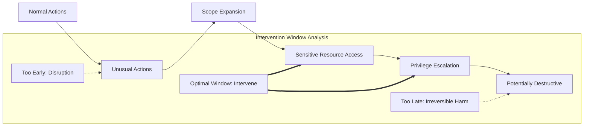
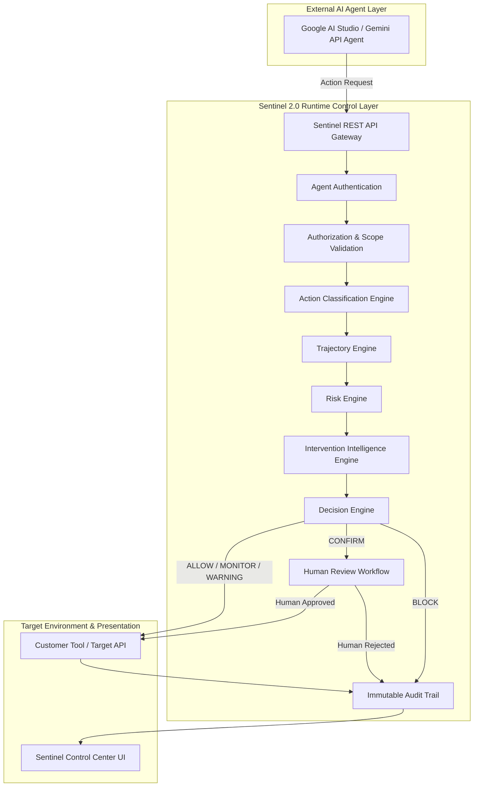

# Sentinel 2.0 — System Architecture Specification

## 1. Sentinel Purpose
**Sentinel 2.0** is an enterprise-grade runtime control layer designed specifically for autonomous and semi-autonomous AI agents. As AI agents transition from passive chat interfaces to active operators executing tool calls, code, database queries, and cloud infrastructure modifications, passive safety guardrails and post-hoc audits become insufficient. Sentinel intercepts and evaluates agent action intents *at runtime*, providing continuous behavioral oversight, scope boundary enforcement, and precise intervention control.

Importantly:
* **Gemini** (via Google AI Studio / Gemini API) is the external AI agent being monitored and controlled.
* **Sentinel** is the runtime control plane. Sentinel is **not** a chatbot.

---

## 2. Core Innovation: The Optimal Intervention Window
Traditional security solutions either block preemptively (generating high friction and false positives) or alert reactively (after damage is already done).

Sentinel's core thesis:
> **"Don't just detect risk. Know when to intervene."**

AI agents expand their behavior along an observable trajectory:
```
Normal Actions → Unusual Actions → Scope Expansion → Sensitive Resource Access → Privilege Escalation → Potentially Destructive Actions
```

Intervention timing balances disruption cost against catastrophic harm:
* **Too early**: Unnecessary disruption to agent autonomy and user workflow.
* **Optimal Intervention Window**: Intervene at the precise moment before irreversible or serious harm occurs.
* **Too late**: Unmitigated breach or irreversible state mutation.



Sentinel evaluates this continuum to output one of five runtime decisions:
* `ALLOW`: Action is benign, permitted within baseline constraints.
* `MONITOR`: Action permitted with enhanced telemetric observation.
* `WARNING`: Anomaly flagged; acceleration threshold triggered.
* `CONFIRM`: Execution held pending explicit human review.
* `BLOCK`: Action prohibited; potential hazard mitigated.

---

## 3. High-Level System Architecture



---

## 4. Frontend Architecture
The frontend is built with **React 18**, **Vite**, **TypeScript**, and **Tailwind CSS**, supplemented by **Recharts** for future time-series visualization.

### Design Direction: "Pixel-Inspired Security Control Center"
* **Aesthetic Philosophy**: Tactile surfaces, subtle elevation (`box-shadow`), generous spacing, and purposeful rounded shapes (`rounded-2xl`, `rounded-full`).
* **Avoids**: Generic purple AI gradients, excessive glassmorphism, startup dashboard templates, and meaningless visual fluff.
* **Themes**: Full native support for Light and Dark themes, managed via `ThemeContext` and CSS variables in `design-tokens.css`.
* **Modes**: Instant toggle between **Simple Mode** (default) and **Expert Mode**, backed by `ModeContext`. Context and active states are preserved across switches.

### Directory Structure
```
frontend/src/
├── api/          # Centralized API client & endpoint definitions
├── components/   # Reusable atomic & composite components
│   ├── common/   # ErrorBoundary, StatusIndicator, MetricCard, EmptyState, LoadingState
│   ├── navigation/# TopBar, NavigationRail, ModeSwitcher, ThemeSwitcher
│   └── shells/   # AppShell
├── features/     # Feature views
│   ├── simple/   # SimpleOverview (Plain language, user-friendly)
│   └── expert/   # ExpertOverview (Technical telemetry, intervention window)
├── hooks/        # React hooks (useMode, useTheme, useHealth)
├── layouts/      # Layout containers
├── pages/        # DashboardPage (mode-aware container)
├── services/     # Frontend business & data access services
├── stores/       # React Contexts (modeContext, themeContext)
├── styles/       # design-tokens.css, index.css
└── types/        # Frontend-specific type augmentations
```

---

## 5. Backend Architecture
The backend is built with **Node.js**, **Express**, and **TypeScript**, configured as a modular API.

### Key Tenets
* **Decoupled Application Setup**: `app.ts` configures middleware and routes without binding ports, allowing automated integration testing via `supertest`.
* **Server Lifecycle**: `server.ts` manages process signals (`SIGTERM`, `SIGINT`) and graceful shutdown.
* **Security Middleware**: `helmet` for HTTP headers, strict CORS configuration, structured JSON body parsing.
* **Resilient Error Handling**: Centralized `errorHandler` maps operational vs. unexpected exceptions, shielding internal implementation details in production.

### Directory Structure
```
backend/src/
├── config/       # Environment loading & validation
├── database/     # Database client abstraction (Supabase stub for Phase 0)
├── middleware/   # Request logging, error handling, 404 handler
├── modules/      # Prepared domain modules (Phase 1-5 targets)
│   ├── actions/
│   ├── agents/
│   ├── authorization/
│   ├── decisions/
│   ├── intervention/
│   ├── interventions/
│   ├── risk/
│   ├── scenarios/
│   └── trajectory/
├── routes/       # Health routes and API mount points
├── services/     # Backend business logic services
├── app.ts        # Express app initialization
└── server.ts     # Process entry point
```

---

## 6. Future Intelligence Modules (Architectural Roadmap)
1. **Agents (`modules/agents`)**: Agent registry, cryptographic credential validation, session token issuance, and metadata tracking.
2. **Authorization (`modules/authorization`)**: Granular scope checking, resource URI wildcard matching, and role constraint validation.
3. **Actions (`modules/actions`)**: Ingestion and canonicalization of external agent tool invocations (`READ`, `WRITE`, `EXECUTE`, `NETWORK`, `AUTH`, `ADMIN`).
4. **Trajectory Engine (`modules/trajectory`)**: Statistical state machine comparing agent behavior against historical baselines to flag scope expansion and drift.
5. **Risk Engine (`modules/risk`)**: Multi-factor quantitative scoring (resource sensitivity, severity, reversibility penalty, and acceleration).
6. **Intervention Intelligence (`modules/intervention`)**: Calculates the *Optimal Intervention Window*, balancing disruption cost against potential harm.
7. **Decision Engine (`modules/decisions`)**: Synthesizes engine inputs into final enforcement directives (`ALLOW`, `MONITOR`, `WARNING`, `CONFIRM`, `BLOCK`).
8. **Interventions (`modules/interventions`)**: Real-time human-in-the-loop escalation queues and webhook dispatching.
9. **Scenarios (`modules/scenarios`)**: Evaluation harnesses, red-team simulation scenarios, and counterfactual benchmark replays.

---

## 7. Simple Mode
Designed for non-technical stakeholders, managers, and hackathon evaluators. Simple Mode answers three fundamental questions:
1. **What is happening?**
2. **Is it safe?**
3. **Do I need to do something?**

### Vocabulary Translation
* `SAFE` (ALLOW / Normal): Actions verified within baseline safety envelope.
* `WATCHING` (MONITOR / Minor drift): Sentinel is observing unusual frequency or new tools.
* `ATTENTION` (WARNING / High risk acceleration): Agent is behaving differently from usual.
* `APPROVAL NEEDED` (CONFIRM / Optimal window): Agent wants human permission before continuing.
* `STOPPED` (BLOCK / Prevent harm): Sentinel stopped an action to prevent unsafe consequences.

---

## 8. Expert Mode
Designed for AI security engineers, ML platform teams, and SecOps operators. Exposes:
* Granular risk scores (0–100) decomposed into sensitivity, severity, velocity, and reversibility.
* Visual **Intervention Window** stage indicator (`TOO_EARLY`, `MONITOR`, `WARNING`, `OPTIMAL_INTERVENTION_WINDOW`, `CONFIRM`, `TOO_LATE`).
* Full tool invocation sequence, argument payloads, and target resource metadata.
* Execution timelines, scope constraint verifications, and cryptographic audit signatures.

---

## 9. Gemini Integration Plan (Target: Phase 1+)
* **External AI Agent Model**: Gemini 1.5 Pro and Gemini 1.5 Flash via official `@google/genai` or `@google/generative-ai` SDK.
* **Server-Side Security**: All Gemini API keys, prompt templates, and execution tokens remain exclusively on the backend. No keys are ever delivered to the client.
* **Proxy Architecture**: The Gemini agent invokes tool calls via Sentinel's control endpoint. Sentinel processes the call through the intelligence pipeline before either delegating to the actual target tool or halting execution.

---

## 10. Database Integration Plan (Target: Phase 2)
* **Target Engine**: Supabase (PostgreSQL with Row Level Security).
* **Storage Schema**:
  * `agents`: Registered agents, model IDs, owner IDs, assigned scopes.
  * `sessions`: Runtime sessions, aggregate risk scores, start/end timestamps.
  * `action_events`: Discrete tool invocations, parameters, target classifications.
  * `risk_evaluations`: Component scores, deviation values, intervention decisions.
  * `human_reviews`: Approval requests, reviewer identities, resolution decisions.
* **Migration Strategy**: Version-controlled SQL migration scripts under `backend/src/database/migrations/`.

---

## 11. Security Principles
1. **Zero-Trust Client**: The frontend is strictly a visualization and review interface. The backend never accepts client-asserted risk scores, agent identities, or decisions.
2. **Fail-Closed Default**: In the event of an internal engine timeout or network failure during high-risk evaluation, Sentinel defaults to `CONFIRM` or `BLOCK`.
3. **No Hardcoded Secrets**: All credentials and environment configurations are injected via environment variables; version control strictly rejects secrets.
4. **Reversibility Weighting**: Non-reversible actions (e.g., file deletion, database drops, cloud infrastructure modification) carry a heavy penalty in the Intervention Engine.

---

## 12. Phased Development Plan
* **Phase 0 (Completed)**: Foundational architecture, monorepo workspaces, shared vocabulary, UI design system ("Pixel-inspired control center"), health endpoints, CI pipeline, testing harnesses, and comprehensive documentation.
* **Phase 1 (Completed)**: Core agent identity registry, session management, action ingestion pipeline, in-memory repository abstractions, scope authorization engine, deterministic policy decisions (`ALLOW`, `MONITOR`, `WARN`, `CONFIRM`, `BLOCK`), external agent demo simulation (`scripts/demo-external-agent.ts`), and frontend views for Agents, Sessions, and Live Actions stream.
* **Phase 2 (Next)**: Supabase database integration, persistent audit logging, and historical session queries.
* **Phase 3**: Trajectory engine, statistical baseline drift detection, and multi-factor quantitative risk scoring.
* **Phase 4**: Intervention intelligence engine, optimal window computation, and live human approval workflow.
* **Phase 5**: Full Gemini API integration, live agent scenario lab, counterfactual simulations, and presentation polish.

---

## 13. Remote Development Setup
Sentinel 2.0 is built to run identically across local environments, Antigravity IDE, remote development containers, and cloud CI runners:
* **OS-Agnostic**: All scripts use cross-platform node commands (`tsx`, `vitest`, `vite`) and POSIX-compatible npm scripts.
* **Zero Machine Paths**: No hardcoded drive letters or user directories.
* **Isolated Workspaces**: Shared TypeScript definitions are compiled locally or mapped directly via workspace references.
